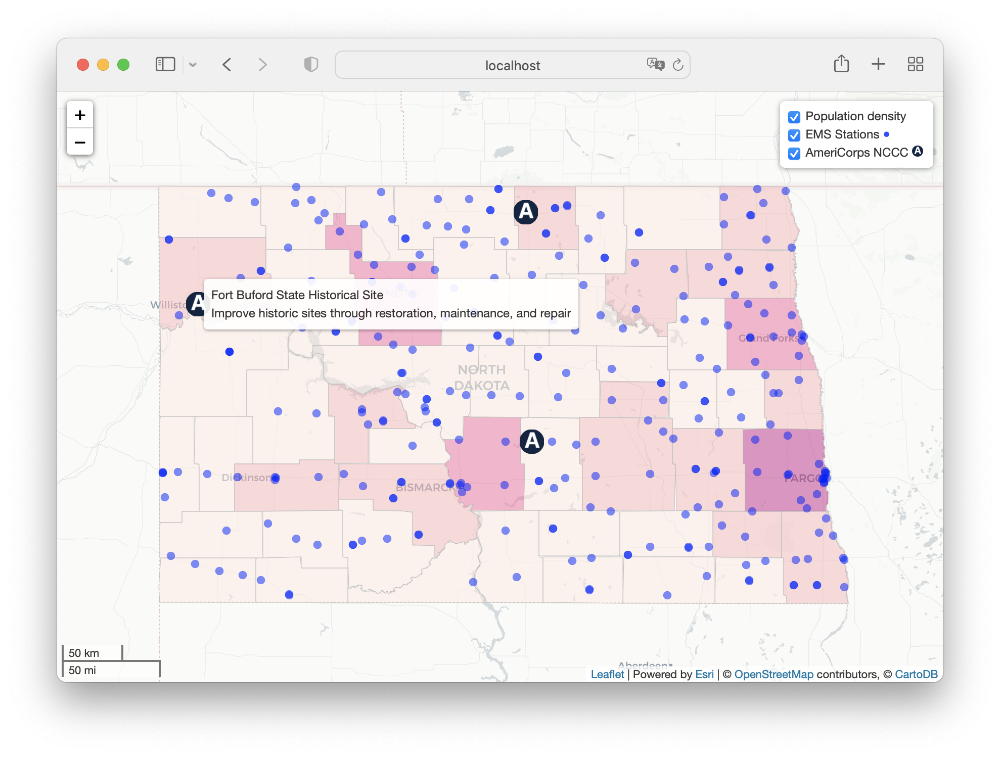

# leaflet-maps-open-data-apis
Leaflet map with multiple API data feeds Socrata and Esri ArcGIS Online. View [demo](https://handsondataviz.github.io/leaflet-maps-open-data-apis/index.html).



If you plan to query Socrata heavily, it is recommended you sign up for an API token. See more details at https://dev.socrata.com/.

### Example of data fetch from Socrata

Assuming you have your `map` initialized and layers control created, load data from a GeoJSON endpoint in Socrata and add it to the map, using custom icons for markers.

```javascript
$.getJSON("https://data.medicare.gov/resource/xubh-q36u.geojson?state=ND", function(data) {

  var hospitals = L.geoJSON(data, {
    pointToLayer: function(feature, latlng) {
      return L.marker(latlng, {
        icon: L.icon({
          iconUrl: 'images/hospital.png',
          iconSize: [24, 24],
          iconAnchor: [12, 12],
          opacity: 0.5
        })
      }).bindTooltip(
        feature.properties.hospital_name
          + '<br>' + feature.properties.city
          + '<br>' + feature.properties.zip_code
      )
    }
  }).addTo(map)
  
})
```

### Example of data load using esri-leaflet plugin

Esri-leaflet plugin allows you to load the data without using jQuery's `getJSON()` function.
You can add point-level data to the map as shown below:

```javascript
var ems = L.esri.featureLayer({
  url: 'https://services1.arcgis.com/Hp6G80Pky0om7QvQ/arcgis/rest/services/EMS_Stations/FeatureServer/0',
  where: "STATE = 'ND'",
  pointToLayer: function(feature, latlng) {
    return L.circleMarker(latlng, {
      radius: 4,
      fillColor: 'blue',
      color: 'blue',
      weight: 0.1,
      opacity: 1,
      fillOpacity: 0.5,
      pane: 'markerPane'  // to make sure points stay above polygons and remain clickable
    }).bindTooltip(feature.properties.NAME)
  }
}).addTo(map)
```

## Learn more

- [Pull Open Data into Leaflet Map with APIs Tutorial](https://handsondataviz.org/leaflet-maps-open-apis.html) in *Hands-On Data Visualization* book (https://HandsOnDataViz.org)
- Leaflet-esri example (https://github.com/jackdougherty/leaflet-esri) by Jack Dougherty
- Tim Stallmann, Mapping external GeoJSON data, https://www.savaslabs.com/blog/mapping-external-geojson-data

## Credits
* Leaflet ([see license](https://github.com/Leaflet/Leaflet/blob/master/LICENSE))
* Esri Leaflet plugin (Apache 2.0)
* jQuery (MIT)
